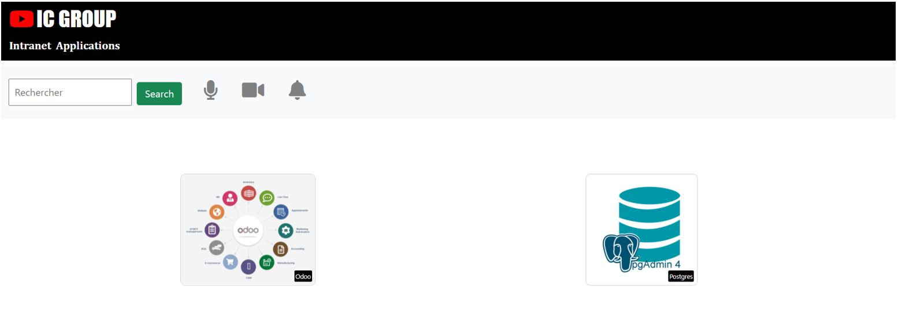

# ic-webapp

## **2.1 CONTEXTE**

La société **IC GROUP** dans laquelle vous travaillez en tant qu’ingénieur Devops souhaite mettre sur pied un site web vitrine devant permettre d’accéder à ses 02 applications phares qui sont :  

1) Odoo et 
1) pgAdmin 

**Odoo**, un ERP multi usage qui permet de gérer les ventes, les achats, la comptabilité, l’inventaire, le personnel …  

Odoo est distribué en version communautaire et Enterprise. ICGROUP souhaite avoir la main sur le code et apporter ses propres modifications et customisations ainsi elle a opté pour l’édition communautaire.  Plusieurs versions de Odoo sont disponibles et celle retenue est la 13.0 car elle intègre un système de LMS (Learning Management System) qui sera utilisé pour publier les formations en internes et ainsi diffuser plus facilement l’information.  

Liens utiles : 

- Site officiel :[ https://www.odoo.com/ ](https://www.odoo.com/) 
- GitHub officiel:[ https://github.com/odoo/odoo.git ](https://github.com/odoo/odoo.git) 
- Docker Hub officiel :[ https://hub.docker.com/_/odoo ](https://hub.docker.com/_/odoo) 

**pgAdmin** quant à elle devra être utilisée pour administrer de façon graphique la base de données PostgreSQL crée précédemment. 

- Site officiel :[ https://www.pgadmin.org/ ](https://www.pgadmin.org/) 
- Docker Hub officiel:[ https://hub.docker.com/r/dpage/pgadmin4/ ](https://hub.docker.com/r/dpage/pgadmin4/) 

Le site web vitrine a été conçu par l’équipe de développeurs de l’entreprise et les fichiers y relatifs se trouvent dans le repo suscité : [ https://github.com/takoukam/B3_Ynov_ic-webapp.git ](https://github.com/takoukam/B3_Ynov_ic-webapp.git) . Il est de votre responsabilité de conteneuriser cette application tout en permettant la saisie des différentes URL des applications (Odoo et pgadmin) par le biais des variables d’environnement. 

Ci-dessous un aperçu du site vitrine attendu. 

**NB :** L’image** créée devra permettre de lancer un container permettant d’héberger ce site web et ayant les liens adéquats permettant d’accéder à nos applications internes 

## **2.2 Conteneurisation de l’application web.** 

Il s’agit en effet d’une application web python utilisant le module Flask. Les étapes à suivre pour la conteneurisation de cette application sont les suivantes : 

1) Image de base : `python:3.6-alpine`
2) Définir le répertoire `/opt` comme répertoire de travail 
3) Installer le module Flask à l’aide de `pip install`
4) Exposer le port `8080` qui est celui utilisé par défaut par l'application
5) Créer les variables d’environnement `ODOO_URL` et `PGADMIN_URL` afin de permettre la définition de ces url lors du lancement du container 
6) Lancer l’application `app.py` dans le `ENTRYPOINT` grâce à la commande `python`  

Une fois le Dockerfile crée, Buildez le et lancer un container test permettant d’aller sur les sites web officiels de chacune de ces applications (site web officiels fournis ci-dessus). 

**Nom de l’image :**  ic-webapp ;*  
**tag :** 1.0*  
**container test_name :** test-ic-webapp* 

Une fois le Dockerfile crée, faites le Build et puis le run du container test permettant d’aller sur les sites web officiels de chacune de ces applications (site web officiels fournis ci-dessus). 

**NB** :Bien vouloir prêter attention aux qualités encadrées en noir ci-dessus, vous vous rendez compte en effet que maitrisez les technologies seulement ne suffit pas, il faut en plus de ça avoir un esprit très créatif, de très bonnes capacités rédactionnelles pour rédiger vos différents rapports et également des qualités de pédagogue qui vous aideront à parfaire les explications de vos    actions dans vos différents rapports. 

Compte tenu de tout cela, je vous invite tous à donner l’importance à ce volet « rapport » de votre projet final, car c’est également une partie très importante qui devra pouvoir décrire le contenu de l’ensemble de votre travail.  

Merci de le rédiger correctement avec les captures d’écran, commentaires et explications qui vont bien car cette partie sera prise en compte dans votre note finale.

### ***Bon courage et surtout joyeux noël et meilleurs vœux à tous pour l’année 2022.***